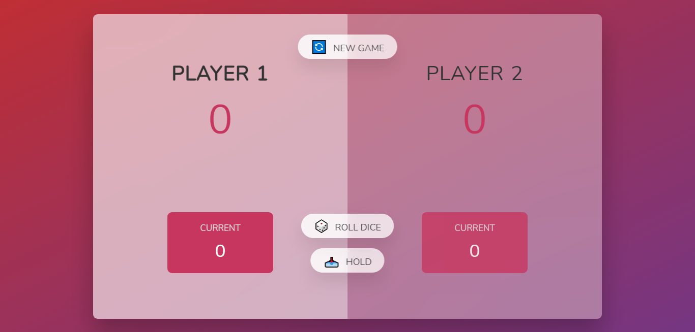

# Pig Dice Game

## Practice Project

## Gameplay

- The game has 2 players, playing in rounds

- In each turn, a player rolls a dice as many times as he whishes. Each result get added to his current score.

- But, if the player rolls a 1, all his current score gets lost. After that, it's the next player's turn.

- The player can choose to hold, which means that his current score gets added to his total score.
  After that, it's the next player's turn.

- The first player to reach 100 points on total score wins the game.

## What I Learned

- Generate a random number.

- Add, remove and toggle HTML class.

- Manipulate the DOM.

- Read From the DOM.

- Call Back Function.

- Anonymous Function.

- Event Handler.

- Ternary operator.

- Apply DRY principle.

## Setup/Installation

- Clone repository on your local computer

- Open index.html in web browser

## Technologies Used

- HTML

- CSS

- JavaScript
